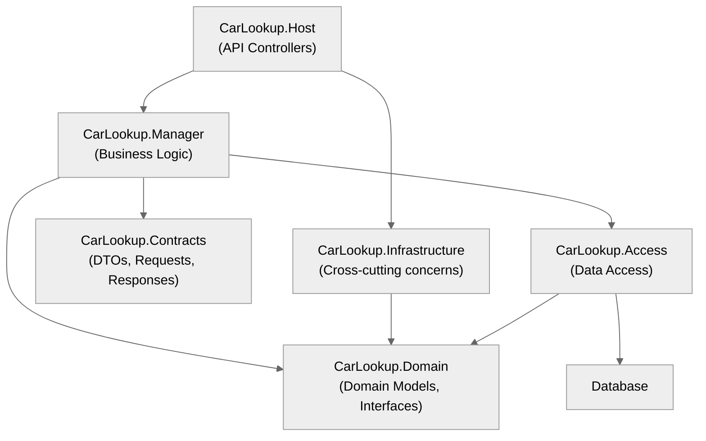

# CarLookup API

## Overview
CarLookup is a RESTful API for managing and querying car makes and models.

Built with .NET 9, it features robust authentication, role-based authorization, and a clean layered architecture.

The API provides comprehensive endpoints for CRUD operations on car makes and models with proper validation and error handling.

## Getting Started

### Prerequisites
- [.NET 9 SDK](https://dotnet.microsoft.com/download)
- [SQL Server](https://www.microsoft.com/sql-server) (LocalDB or Express works for development)
- [Visual Studio 2022](https://visualstudio.microsoft.com/) or another IDE of your choice

### Setup Instructions
1. Clone the repository:
```
git clone https://github.com/yourusername/carlookup.git
cd carlookup
```

2. Restore dependencies:
```
dotnet restore
```

3. Configure connection string in `appsettings.json` or using user secrets:
```
dotnet user-secrets set "ConnectionStrings:Default" "Server=(localdb)\\mssqllocaldb;Database=CarLookupDb;Trusted_Connection=True;"
```

4. Run the application:
```
dotnet run --project src/CarLookup.Host/CarLookup.Host.csproj
```

### Database Setup
The database is automatically created and seeded with sample data during development when the application starts. This behavior is controlled by the `Data:SeedOnStartup` setting in your configuration (defaults to `true` in development).

## API Endpoints

### Authentication
- `POST /api/v1/auth/token` - Obtain JWT token for authentication

### Car Makes
- `GET /api/v1/carmakes` - List all car makes (paginated)
- `GET /api/v1/carmakes/{id}` - Get car make by ID
- `POST /api/v1/carmakes` - Create a new car make (Editor+ role)
- `PUT /api/v1/carmakes/{id}` - Update a car make (Editor+ role)
- `DELETE /api/v1/carmakes/{id}` - Delete a car make (Admin role)

### Car Models
- `GET /api/v1/carmakes/{makeId}/models` - List all models for a make (paginated)
- `GET /api/v1/carmakes/{makeId}/models/{id}` - Get car model by ID
- `POST /api/v1/carmakes/{makeId}/models` - Create a new car model (Editor+ role)
- `PUT /api/v1/carmakes/{makeId}/models/{id}` - Update a car model (Editor+ role)
- `DELETE /api/v1/carmakes/{makeId}/models/{id}` - Delete a car model (Admin role)

## Authentication & Authorization

The API uses JWT Bearer token authentication. Tokens can be obtained from the `/api/v1/auth/token` endpoint. The system implements role-based authorization with three levels:

- **Admin**: Full access to all endpoints
- **Editor**: Can read all data and create/update makes and models
- **Reader**: Read-only access to all data

To run tests:
```
dotnet test
```

## Code Style
- Uses modern C# 13 features
- Follows SOLID principles
- Implements clean architecture with clear separation of concerns
- Uses comprehensive exception handling with custom middleware
- Includes XML documentation comments

## Planned Improvements
- **Real Authentication**: Identity Server or Azure AD integration
- **Caching**: Redis with cache tags and distributed invalidation
- **Database Scaling**: Read replicas and query optimization
- **Monitoring**: Application Performance Monitoring (APM)
- **Soft Deletes**: Audit trail with soft delete implementation

## Architecture

