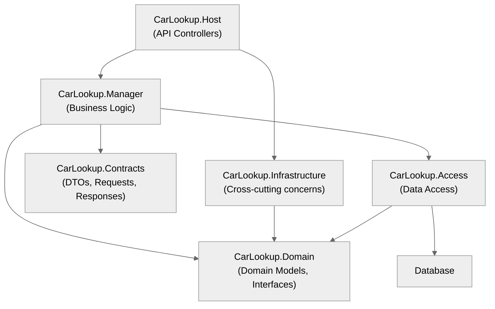

# CarLookup API

[](https://github.com/luiello/CarLookupAPI/actions/workflows/dotnet.yml)

## Overview
CarLookup is a RESTful API for managing and querying car makes and models.

Built with .NET 9, it features robust authentication, role-based authorization, and a clean layered architecture.

The API provides comprehensive endpoints for CRUD operations on car makes and models with proper validation and error handling.

## Getting Started

### Prerequisites
- [.NET 9 SDK](https://dotnet.microsoft.com/download)
- [SQL Server](https://www.microsoft.com/sql-server) (LocalDB or Express works for development)

### Setup Instructions
1. Clone the repository:
```
git clone https://github.com/luiello/CarLookupAPI.git
cd carlookup
```

2. Restore dependencies:
```
dotnet restore
```

3. Configure connection string in `appsettings.json` or using user secrets:
```
dotnet user-secrets set "ConnectionStrings:Default" "Server=(localdb)\\mssqllocaldb;Database=CarLookupDb;Trusted_Connection=True;"
```

4. Run the application:
```
dotnet run --project src/CarLookup.Host/CarLookup.Host.csproj
```

### Database Setup
The database is automatically created and seeded with sample data during development when the application starts. This behavior is controlled by the `Data:SeedOnStartup` setting in your configuration (defaults to `true` in development).

## Authentication & Authorization
The API uses JWT Bearer token authentication. Tokens can be obtained from the `/api/v1/auth/token` endpoint. The system implements role-based authorization with three levels:

- **Admin**: Full access to all endpoints
- **Editor**: Can read all data and create/update makes and models
- **Reader**: Read-only access to all data

## API Endpoints
### Authentication
- `POST`	`/api/v1/Auth/token`	-	Authenticate user and generate JWT token

### Car Makes
> <sub>Role: Reader (or above)</sub>
- `GET` `/api/v1/carmakes`	-	Get all car makes with pagination and filtering
- `GET` `/api/v1/carmakes/{carMakeId}`	-	Get a specific car make by ID
- `GET` `/api/v1/carmakes/{carMakeId}/carmodels`	-	Get car models for a specific car make
> <sub>Role: Editor (or above)</sub>
- `POST` `/api/v1/carmakes`	-	Create a new car make
- `PUT` `/api/v1/carmakes/{carMakeId}`	-	Update an existing car make
> <sub>Role: Admin</sub>
- `DELETE` `/api/v1/carmakes/{carMakeId}`	-	Delete a car make

### Car Models
> <sub>Role: Reader (or above)</sub>
- `GET` `/api/v1/carmodels/{carModelId}`	-	Get a specific car model by ID
> <sub>Role: Editor (or above)</sub>
- `POST` `/api/v1/carmodels`	-	Create a new car model
- `PUT` `/api/v1/carmodels/{carModelId}`	-	Update an existing car model
> <sub>Role: Admin</sub>
- `DELETE` `/api/v1/carmodels/{carModelId}`	-	Delete a car model

## Testing
The project includes testing:
- **Unit Tests**: Fast, isolated component testing
- **Integration Tests**: Database integration with SQL Server containers
- **Acceptance Tests**: End-to-end API workflow testing

To run tests:
```
dotnet test
```
### Postman Testing
Postman collections are available in the `/postman` folder:

- **`CarLookupAPI.postman_collection.json`** - Complete API test collection with automated testing scripts
- **`Develop Env.postman_environment.json`** - Development environment configuration (localhost:57484)
  
## Code Style
- Uses modern C# 13 features
- Follows SOLID principles
- Implements clean architecture with clear separation of concerns
- Uses comprehensive exception handling with custom middleware
- Includes XML documentation comments

## Architecture



---

## Planned Improvements
- **Containerization**: Isolation and portability improvement (including integration test runs)
- **Real Authentication**: Identity Server or Azure AD integration
- **Caching**: Redis with cache tags and distributed invalidation
- **Database Scaling**: Read replicas and query optimization
- **Monitoring**: Application Performance Monitoring (APM)
- **Soft Deletes**: Audit trail with soft delete implementation
